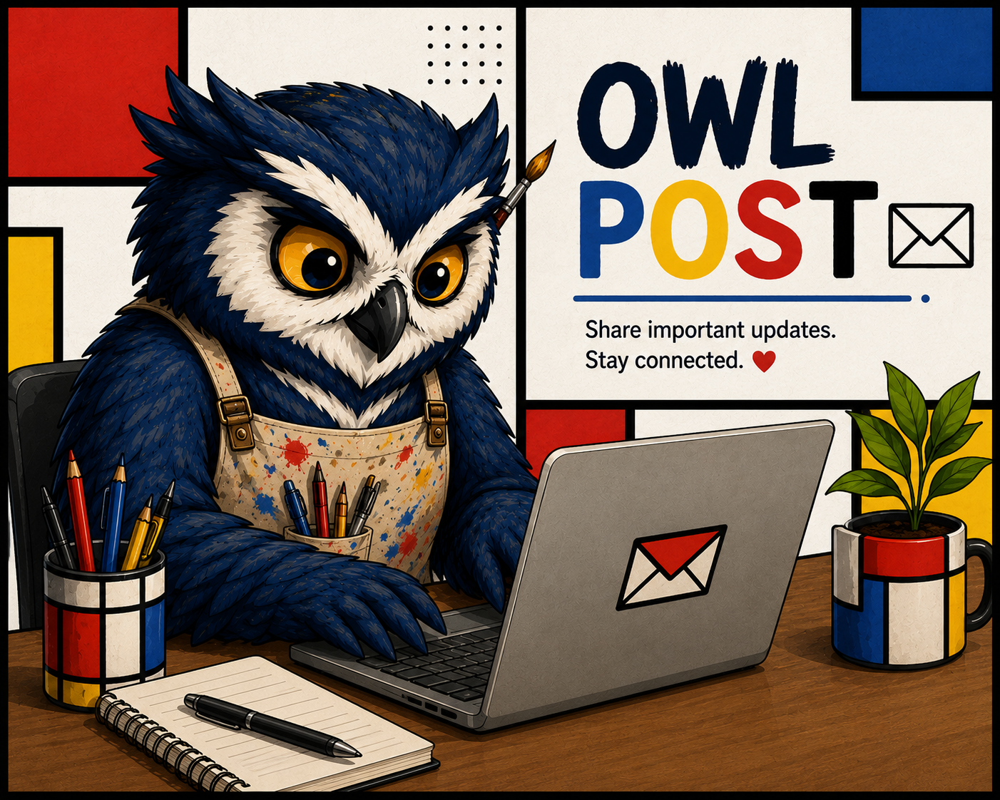

# Owl Post



**Helping students build stronger connections between school and home through meaningful communication.**

Owl Post lets students compose meaningful updates, routes every message to a teacher for review, and sends approved communication to the student's family through Google Apps Script.

## Files for GitHub Pages

- `index.html` — GitHub Pages website with Luckiest Guy headings, Mondrian styling, Rowlie, and an embedded Owl Post app.
- `config.js` — the single place where you paste the deployed Google Apps Script web-app URL.
- `owl-post-rowlie.png` — the approved no-goggles Rowlie artwork.
- `.nojekyll` — tells GitHub Pages to serve the project as a normal static site.
- `apps-script-backup/` — backup of the Apps Script files from the working Owl Post build. These files are not executed by GitHub.

## Connect the live Owl Post app

1. Open `config.js`.
2. Replace `https://script.google.com/macros/s/AKfycbyM7SfBS4IXLwLYczEScaXwcm6fTbyDyIJhCdTpvYTzHYHx_07OoC0Q0RvshFJT3a3T/exec` with the Apps Script deployment URL ending in `/exec`.
3. Keep the quotation marks.
4. Commit the change.

Example:

```js
window.OWL_POST_CONFIG = {
  webAppUrl: "https://script.google.com/macros/s/DEPLOYMENT_ID/exec"
};
```

The Apps Script deployment must use:

- **Execute as:** Me
- **Who has access:** Anyone with the link

## Publish with GitHub Pages

1. Create or open the `owl-post` repository.
2. Upload all files from this folder to the **top level** of the repository.
3. Open **Settings → Pages**.
4. Choose **Deploy from a branch**.
5. Select `main` and `/ (root)`.
6. Save and wait for the live website address to appear.

## Important

Do not use the Google Sheet address in `config.js`. Use the deployed Apps Script web-app URL ending in `/exec`.

## Technology

HTML, CSS, JavaScript, Google Apps Script, Google Sheets, and Gmail.
